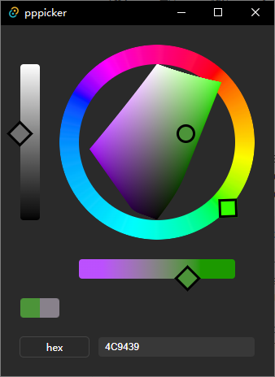

# pppicker
 
- 功能: 一个更自然的拾色器

- 核心代码: `./src/main.ts`

- 试用: 自行到 release 中下载安装包

- 部署与运行
  - 安装依赖: `pnpm i`
  - 快速开发预览: `pnpm run tauri dev`
  - 构建: `pnpm run tauri build`
  
- 依赖库:
  - `vanjs` - 最轻量级的前端响应式框架
  - `culori` - 色彩转换库
  - `tauri` - 桌面端框架

- 未来优化方向:
  - 增加横截面色盘, 目前这个只有纵截面
  - 增加更多色彩模型, 比如 oklch, 谷歌的 hct, 进而增加更多色彩系统之间的转换
  - 让这个拾色器可以直接控制绘画软件中的颜色, 可能还要在绘画软件中写一个专门的插件(强烈吐槽 ps 的 uxp 插件系统🤮).

- 补充: 有一个函数是用 ai 写的, 猜猜是哪个😋

- 展示:  

