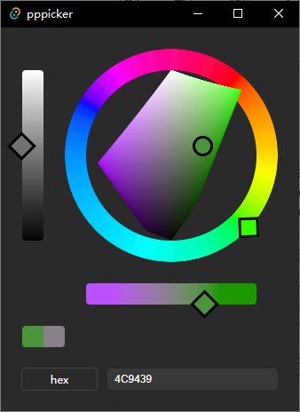

# pppicker

- **Function**: A more natural color picker

- **Core Code**: `./src/main.ts`

- **Try it out**: Download the installation package from the release page

- **Deployment & Running**
  - Install dependencies: `pnpm i`
  - Quick development preview: `pnpm run tauri dev`
  - Build: `pnpm run tauri build`

- **Dependencies**:
  - `vanjs` - The most lightweight front-end reactive framework
  - `culori` - Color conversion library
  - `tauri` - Desktop application framework

- **Future Improvements**:
  - Add a cross-sectional color wheel (currently only has a longitudinal section)
  - Add support for more color models, such as OKLCH and Google's HCT, thereby enabling more conversions between color systems
  - Enable the color picker to directly control colors in painting software, which may require writing a dedicated plugin for the painting software

---

- screenshot:  

